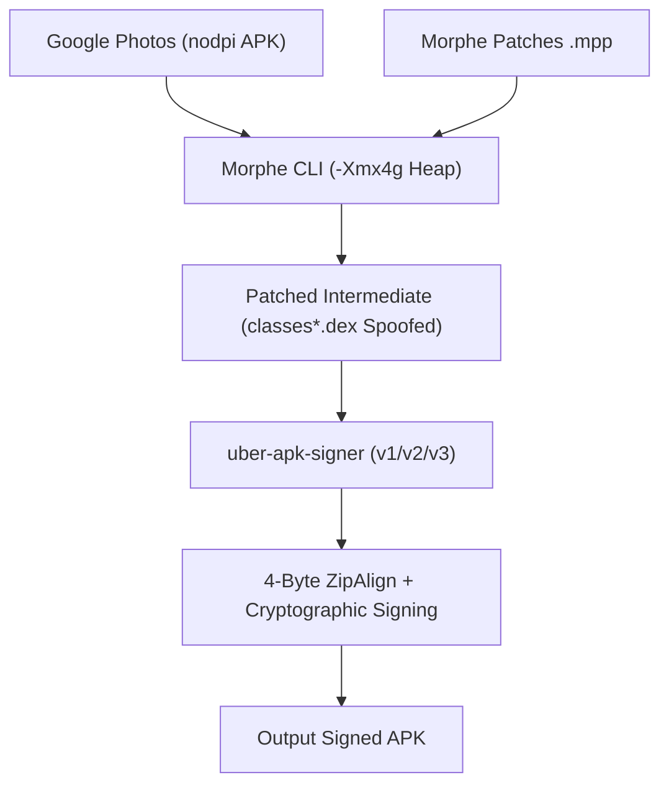

# Morphe Google Photos Patching Pipeline

[](https://www.gnu.org/licenses/gpl-3.0)
[](https://nodejs.org)
[-orange.svg>)](https://www.oracle.com/java/)

Standalone build toolkit for patching **Google Photos** (`com.google.android.apps.photos`) using the **Morphe** ecosystem. Spoofs the Pixel XL (`marlin`) hardware fingerprint to enable unlimited original-quality cloud backup via GmsCore (MicroG) authentication.

---

## Architecture



Key design decisions:

- **Monolithic `nodpi` APK only** — split bundles (`.apkm`, `.xapk`, `.apks`) cause launch crashes and are rejected at validation.
- **4GB JVM heap** (`-Xmx4g`, G1GC) — prevents OOM during multi-dex smali decompilation.
- **uber-apk-signer** — handles zipalign + v1/v2/v3 signing in one pass.
- **Pixel XL spoofing** — injects `NEXUS_PRELOAD` and `marlin` build props for zero-quota uploads.
- **GmsCore routing** — bypasses signature checks, routes auth to standalone MicroG (`app.revanced.android.gms`).

---

## Project Files

| File                                         | Purpose                                                                       |
| :------------------------------------------- | :---------------------------------------------------------------------------- |
| [`config.json`](config.json)                 | Pipeline config: target package, spoof properties, JVM flags, API endpoints   |
| [`options.json`](options.json)               | Morphe CLI patch options for hardware spoofing and GmsCore auth               |
| [`export-profile.json`](export-profile.json) | Importable profile for on-device Morphe Manager                               |
| [`build.ps1`](build.ps1)                     | Windows PowerShell build script with pre-flight checks and transcript logging |
| [`build.mjs`](build.mjs)                     | Cross-platform Node.js build runner (zero npm dependencies)                   |

---

## Prerequisites

- **Java**: 64-bit Java 17 or 21 (JDK/JRE) on `PATH`
- **OS**: Windows 10/11, macOS, or Linux
- **Node.js** _(optional, for `build.mjs`)_: v18.0.0+
- **PowerShell** _(optional, for `build.ps1`)_: 5.1 or Core 7+

---

## Quick Start

### 1. Get the Input APK

> [!IMPORTANT]
> You need a monolithic `nodpi` universal APK. Do not use split bundles.

1. Go to [APKMirror — Google Photos](https://www.apkmirror.com/apk/google-inc/photos/).
2. Pick a recent version, download the variant with **universal** architecture and **nodpi** DPI.
3. Place it in `./input/`.

### 2. Build (PowerShell)

```powershell
.\build.ps1                                          # standard build
.\build.ps1 -InputApk "C:\Downloads\photos.apk"     # custom input
.\build.ps1 -Clean                                   # clean build
```

### 3. Build (Node.js)

```bash
node build.mjs                                # standard build
node build.mjs --input ./input/photos.apk     # custom input
node build.mjs --clean                        # clean build
```

Output: `./output/com.google.android.apps.photos-morphe-signed.apk`

### 4. On-Device Patching (Morphe Manager)

1. Install [Morphe Manager](https://github.com/MorpheApp/morphe-manager/releases).
2. Import [`export-profile.json`](export-profile.json) via Settings > Import Profile.
3. Select a monolithic Google Photos APK and patch.

---

## Installation

### Install GmsCore

Required for Google account auth on non-root devices.

Download from [ReVanced GmsCore](https://github.com/ReVanced/GmsCore/releases) or [MicroG-RE](https://github.com/MorpheApp/MicroG-RE/releases). Install and sign in.

### Install the Patched APK

```bash
adb install -r output/com.google.android.apps.photos-morphe-signed.apk
```

### Battery Optimization

Set both **Google Photos** and **GmsCore** to **Unrestricted** battery mode. On Xiaomi/MIUI, also enable **Autostart**. Without this, background backup will be killed.

---

## Verifying Unlimited Backup

1. Open patched Google Photos > Profile > Settings > Backup.
2. Confirm the banner reads: **"This Pixel can back up unlimited photos & videos at no charge."**
3. Upload a large file, then check [one.google.com/storage](https://one.google.com/storage) — quota should not increase.

---

## Troubleshooting

| Symptom                                               | Cause                             | Fix                                                        |
| :---------------------------------------------------- | :-------------------------------- | :--------------------------------------------------------- |
| `CRITICAL INTEGRITY REJECTION: ... is a split bundle` | Split APK downloaded              | Use a monolithic `nodpi` APK from APKMirror                |
| `java.lang.OutOfMemoryError: Java heap space`         | Heap too small                    | Ensure 64-bit Java 17+; script sets `-Xmx4g` automatically |
| GmsCore not found / sign-in loops                     | GmsCore missing or battery-killed | Install GmsCore, set battery to Unrestricted               |
| Crash on launch (SIGSEGV / ClassNotFound)             | Bad dex or ABI mismatch           | Verify input was `nodpi`; rebuild with `--clean`           |
| `INSTALL_PARSE_FAILED_NO_CERTIFICATES`                | Broken signature                  | Rebuild with `--clean`; uber-apk-signer handles v1/v2/v3   |
| GitHub API 403                                        | Rate limited                      | Set `GITHUB_TOKEN` environment variable                    |

---

## License

GPL-3.0. See [LICENSE](LICENSE).

_This project is not affiliated with Google LLC. Google Photos and Pixel are trademarks of Google LLC._
