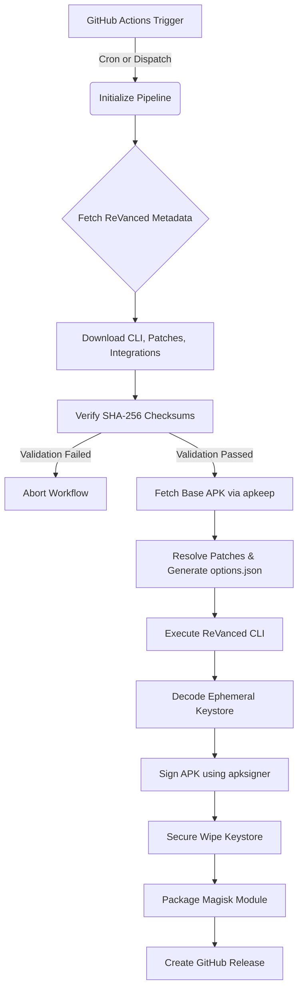

# Architecture and Security Model

This document outlines the security mitigations, threat models, and data flows for the ReVanced Google Photos Pipeline.

## System Architecture

## Threat Mitigations

### 1. Supply Chain Attacks
**Threat:** A compromised dependency, ReVanced component, or GitHub Action exposes the build process to malicious injection.
**Mitigation:**
- **Pinned Action SHAs:** All GitHub Actions use hardcoded, full-length commit SHAs instead of floating tags (e.g., `@v4`).
- **Cryptographic Verification:** Every downloaded binary (ReVanced CLI, patches, integrations) is verified against the official `checksums.txt` published by the ReVanced team. The build aborts if a single byte mismatches.
- **Deterministic Dependencies:** `pnpm-lock.yaml` ensures identical dependency resolution.

### 2. Secret Leakage
**Threat:** The keystore or its passwords are leaked via logs, committed to the repository, or left exposed on the runner.
**Mitigation:**
- **No Binaries in Repo:** The `.gitignore` enforces that no `.keystore`, `.jks`, or `.apk` files are tracked by Git.
- **Runtime Injection:** The keystore is passed as a Base64 string via GitHub Secrets and decoded at runtime.
- **Ephemeral Storage & Guaranteed Wipe:** The keystore is written to a temporary location with strict `0o600` permissions. The orchestrator uses a `try/finally` block to guarantee a cryptographic secure wipe (overwrite with random bytes, then unlink) immediately after signing, even if the build fails or throws an exception.

### 3. Shell Injection
**Threat:** Malicious package names, tags, or options injected into shell commands to execute arbitrary code.
**Mitigation:**
- **`execFile` over `exec`:** The pipeline uses Node.js `child_process.execFile` with an explicit arguments array. Shell interpolation is disabled, neutralizing shell injection vectors.

### 4. Fingerprint Detection Blocking
**Threat:** Scrapers downloading base APKs are blocked by Cloudflare TLS fingerprinting.
**Mitigation:**
- **apkeep:** We avoid custom HTTP scrapers entirely and use `apkeep`, a specialized tool developed by the EFF, to reliably interface with APK providers without requiring API credentials.
