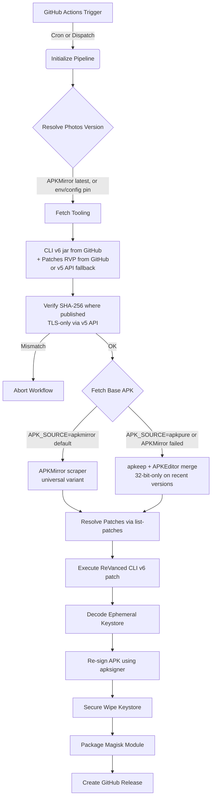

# Architecture and Security Model

This document outlines the data flow, security mitigations, and threat model for the ReVanced Google Photos pipeline.

## System Architecture



## Threat Mitigations

### 1. Supply Chain Attacks

**Threat:** A compromised dependency, ReVanced component, or GitHub Action injects malicious code into the build process.
**Mitigations:**

- **Pinned action SHAs.** All GitHub Actions are referenced by full commit SHA, not floating tags. A re-pointed `@v4` tag cannot swap in malicious code.
- **Cryptographic verification, two-tier.**
  - _Primary:_ The CLI v6 jar exposes its SHA-256 in the release asset's `digest` field (`sha256:<hex>`). The pipeline verifies the downloaded jar against this hash and aborts on any mismatch. Patches and integrations published on GitHub are verified the same way (or via a sibling `.sha256` file / `checksums.txt`).
  - _Fallback:_ When `github.com/ReVanced/revanced-patches` returns HTTP 451 (a recurring DMCA-related state), the pipeline retrieves patches from `https://api.revanced.app/v5/patches`. That feed publishes no SHA-256 — only a `.asc` PGP signature alongside the asset. Integrity in this path rests on TLS to `api.revanced.app`. **Planned hardening:** verify the `.asc` signature against ReVanced's published public key, eliminating reliance on TLS alone for the patches asset.
- **Deterministic dependencies.** `pnpm-lock.yaml` ensures byte-identical npm dependency resolution across builds.

### 2. Secret Leakage

**Threat:** The keystore or its passwords are leaked via logs, committed to the repository, or left exposed on the runner.
**Mitigations:**

- **No binaries in git.** `.gitignore` excludes `.apk`, `.jks`, and `.keystore` files; nothing crypto-sensitive enters the repo's history.
- **Runtime injection.** The keystore is passed as a Base64 string via `KEYSTORE_BASE64` (GitHub Secret) and decoded at runtime to a temporary file with `0o600` permissions.
- **Ephemeral storage with guaranteed wipe.** The orchestrator wraps the signing step in `try/finally`. After signing — successful or failed — the keystore file is overwritten with random bytes and then unlinked. The wipe runs even if the build throws.

### 3. Shell Injection

**Threat:** Adversarial package names, version strings, or option values get interpolated into shell commands and execute arbitrary code.
**Mitigation:**

- **`execFile` with arg arrays.** Every external invocation (`apkeep`, `java -jar revanced-cli.jar`, `apksigner`) goes through Node's `child_process.execFile` with an explicit argv array. There is no shell parser in the path, so meta-characters in untrusted strings are inert.

### 4. APK Source Tampering

**Threat:** The base Google Photos APK downloaded from APKMirror (or the APKPure fallback) is replaced with a malicious build by a network adversary or compromised mirror.
**Mitigations:**

- **TLS to both sources.** APKMirror is fetched with the built-in `fetch` over HTTPS; the APKPure fallback uses `apkeep`, which also does plain TLS to APKPure. No custom HTTP client, no fingerprint-evasion logic, no third-party caches in the chain.
- The pipeline does not currently verify the upstream APK's signature against a known-good Google certificate. This is a known gap — `apksigner verify --print-certs <input.apk>` could be wired in to assert the certificate matches Google's published Google Photos cert before patching. **Planned hardening.**

### APK source selection

The pipeline supports two upstream sources for the base Google Photos APK:

| Source                  | When used                                                     | Pros                                                                                                             | Cons                                                                                                                                 |
| ----------------------- | ------------------------------------------------------------- | ---------------------------------------------------------------------------------------------------------------- | ------------------------------------------------------------------------------------------------------------------------------------ |
| **APKMirror** (default) | Always tried first unless `APK_SOURCE=apkpure`                | Ships true **universal** APKs with all ABIs in one file — installs on every device including 64-bit-only Android | HTML scraping, vulnerable to page redesign and Cloudflare blocks on CI runner IPs                                                    |
| **APKPure** (fallback)  | Used when APKMirror fails, or forced via `APK_SOURCE=apkpure` | Stable `apkeep` CLI, predictable                                                                                 | Recent Photos versions are 32-bit-only on APKPure (only `config.armeabi_v7a.apk` in the XAPK) → merged APK won't install on Pixel 7+ |

The fallback chain is automatic: if APKMirror throws `ApkMirrorError`, the pipeline logs the cause and continues with the APKPure path. To force a specific source, set `APK_SOURCE=apkmirror` or `APK_SOURCE=apkpure`.

## ReVanced CLI v6 transition

The pipeline targets ReVanced CLI v6, which changed the patch invocation surface significantly from v5:

| Concern          | v5- (old)                  | v6 (current)                                                                   |
| ---------------- | -------------------------- | ------------------------------------------------------------------------------ |
| Patch bundle     | `--patch-bundle <file>`    | `-p <file>` (or `--patches`)                                                   |
| Integrations APK | separate `--merge <apk>`   | bundled into the RVP; flag removed                                             |
| Patch options    | `--options <options.json>` | `-O key=value` per option (no JSON file)                                       |
| Enable patches   | `-i <name>`                | `-e <name>` (or `--enable`)                                                    |
| Output path      | `--out <file>`             | `-o <file>` (or `--out`)                                                       |
| Bundle integrity | implicit                   | explicit: either `-b` (bypass) or `-s -k -a` for signature/keyring/attestation |

### Current flags

```
java -jar cli.jar patch \
  -p patches.rvp \
  -b \
  -e "Spoof features" \
  -e "GmsCore support" \
  -o output-patched.apk \
  input.apk
```

The `-b` flag bypasses the CLI's PGP verification of the RVP. This is intentional for now: see "Supply Chain Attacks" above for the planned `.asc`-signature verification that will replace `-b` with the proper `-s -k -a` triple.

### Patch options

The `Spoof features` patch ships with defaults that exactly match Pixel XL configuration:

- _Features to enable:_ `[com.google.android.apps.photos.NEXUS_PRELOAD, com.google.android.apps.photos.nexus_preload]`
- _Features to disable:_ every Pixel 2017+ feature flag, so newer-device features don't override the spoof.

Because the defaults are already correct, the pipeline passes no `-O` overrides. If future patch releases change those defaults, the build will not silently drift — `Spoof features` is a `required` patch and any signature change to its options keys will surface in CI.
