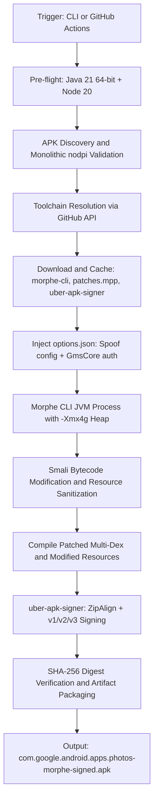
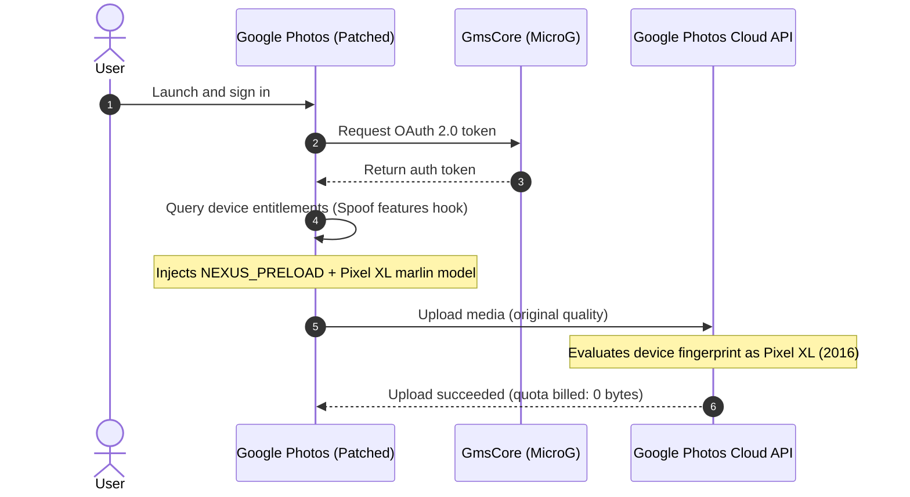

# Architecture

Data flow, component responsibilities, and security model for the Morphe Google Photos pipeline.

---

## Pipeline Flow

---

## Components

### Morphe CLI

- Binary: `morphe-desktop-all.jar` from `MorpheApp/morphe-cli`
- Heap: `-Xmx4g -XX:+UseG1GC` to handle large (~200MB+) DEX files without OOM
- Injects runtime hooks into Dalvik/ART bytecode without breaking DEX structure

### Patch Bundle (`patches.mpp`)

Source: `RookieEnough/De-Vanced` or official Morphe patch repository.

Applied patches:

1. **Spoof features** — enables `NEXUS_PRELOAD` and `nexus_preload`, masks post-2016 Pixel flags
2. **GmsCore support** — redirects Play Services auth to standalone MicroG (`app.revanced.android.gms`)
3. **Fix selected account persistence** — prevents account clearing across app restarts

### uber-apk-signer

- Binary: `uber-apk-signer.jar` from `patrickfav/uber-apk-signer`
- 4-byte zipalign for `mmap()`-optimized layouts
- Signs with v1 (JAR), v2 (APK Signature Scheme v2), and v3 (v3 scheme)

---

## Security Model

### Supply Chain

Toolchain assets are resolved from verified GitHub release repos over TLS. Downloaded to `./tools/` and validated before execution.

### Keystore Management

- CI: keystore supplied via encrypted repo secrets (`KEYSTORE_BASE64`, `KEY_STORE_PASS`, `KEY_ALIAS`, `KEY_PASS`), decoded into ephemeral runtime storage, never committed (enforced by `.gitignore`)
- Local: uber-apk-signer auto-generates a debug certificate if no keystore is provided

### Argument Injection Protection

All external process calls in `build.ps1` and `build.mjs` pass arguments via typed arrays (argv), not shell string interpolation. Prevents injection when handling arbitrary paths or env vars.

---

## Backup Spoofing Mechanism

1. Google Photos queries system feature flags via `PackageManager.hasSystemFeature()`.
2. The Spoof features patch intercepts these calls and asserts `com.google.android.apps.photos.NEXUS_PRELOAD` is present.
3. Google's upload endpoint applies the grandfathered 2016 Pixel XL policy: unlimited original-quality storage with zero quota deduction.
