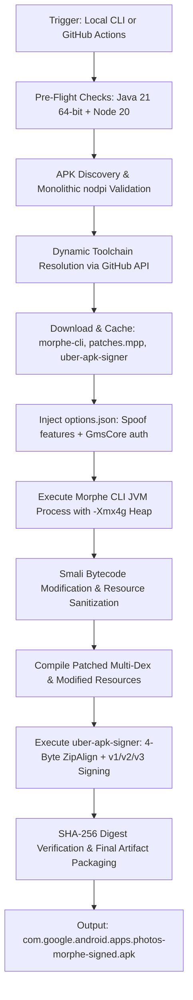
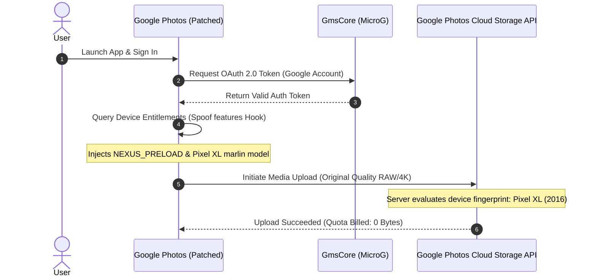

# System Architecture & Security Model

This document outlines the data flow, component architecture, security model, and backup spoofing mechanisms of the **Morphe Google Photos Automation Toolkit**.

---

## 🏛️ System Architecture

---

## 🔧 Core Components & Responsibilities

### 1. Morphe Desktop CLI & Patch Engine

- **Tool**: `morphe-desktop-all.jar` from `MorpheApp/morphe-cli`.
- **Heap Allocation**: Configured with `-Xmx4g` and `-XX:+UseG1GC` to prevent Out-Of-Memory (OOM) failures during smali decompilation of large (~200MB+) Google Photos DEX files.
- **Dynamic Bytecode Patching**: Injects runtime hooks into Google Photos Dalvik/ART bytecode without breaking DEX structural integrity.

### 2. Patch Bundle (`patches.mpp`)

- **Source**: `RookieEnough/De-Vanced` (or official Morphe patch repository).
- **Core Applied Patches**:
  1. `Spoof features`: Enables `com.google.android.apps.photos.NEXUS_PRELOAD` and `nexus_preload` while masking post-2016 Pixel experience flags (`PIXEL_2017+`).
  2. `GmsCore support`: Redirects Play Services authentication to standalone MicroG / GmsCore (`app.revanced.android.gms`) for non-root Google account login.
  3. `Fix selected account persistence`: Prevents Google Photos from clearing selected Google accounts across app restarts.

### 3. uber-apk-signer

- **Tool**: `uber-apk-signer.jar` from `patrickfav/uber-apk-signer`.
- **4-Byte ZipAlign**: Aligns all uncompressed data within the ZIP archive on 4-byte boundaries using `mmap()`-optimized layouts required by modern Android runtime.
- **Multi-Scheme Signatures**: Applies Android cryptographic signing schemes **v1 (JAR signing)**, **v2 (APK Signature Scheme v2)**, and **v3 (APK Signature Scheme v3)**.

---

## 🔒 Security Model & Mitigations

### 1. Supply Chain Integrity & Dynamic Resolution

- Toolchain assets (`morphe-cli`, `patches.mpp`, `uber-apk-signer`) are dynamically resolved from verified GitHub release repositories over TLS.
- Assets are cached locally in `./tools/` and validated before execution.

### 2. Secret Keystore Management

- In CI/CD (GitHub Actions), the release signing keystore is supplied via encrypted repository secrets (`KEYSTORE_BASE64`, `KEY_STORE_PASS`, `KEY_ALIAS`, `KEY_PASS`).
- Keystores are decoded into ephemeral runtime storage and never committed to version control (`.gitignore` enforces exclusions).
- If no custom keystore is supplied, `uber-apk-signer` creates a resilient debug certificate ensuring deterministic local testing.

### 3. Argument Injection Protection

- All external process executions in `build.ps1` and `build.mjs` pass arguments via explicit typed arrays (argv arrays) without evaluating shell strings.
- This prevents argument interpolation or shell injection vulnerabilities when handling arbitrary file paths or environment variables.

---

## ☁️ Google Photos Zero-Quota Backup Mechanism

1. **Client Identification**: Google Photos queries Android system feature flags via `PackageManager.hasSystemFeature()`.
2. **Feature Interception**: The `Spoof features` patch intercepts these calls and asserts that `com.google.android.apps.photos.NEXUS_PRELOAD` is present.
3. **Server-Side Quota Waiver**: Google's upload endpoint inspects the client entitlement and applies the grandfathered 2016 Pixel XL policy: **100% lifetime unlimited original-quality photo and video storage with zero quota deduction**.
